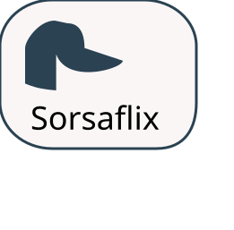

  

# Sorsaflix - movie review and search web-application

## This application is assignment for OAMK Web Development Course
### Team members:
- Antti Buller   
- Elmo Lehtosaari  
- Jere Peltola  
- Jussi Mitteli  

## Tech Stack

| Layer    | Technology                    |
|----------|-------------------------------|
| Frontend | React                         |
| Backend  | Node.js                       |
| Database | PostgreSQL                    |
| Data     | [TMDB API](https://www.themoviedb.org) |

  

## Introduction
This application is part of Oulu University of Applied Sciences Web development course. Goal of this project is to develop a web application consisting of frontend built using React, Node.js backend and a PostgreSQL database.  
  
Functionality of the app includes several features including the following:    
  

| ID  | Feature                    | Status  |
|:---:|:---------------------------|:-------:|
| 1   | Responsiveness             | ⬜      |
| 2   | Registration               | ✅      |
| 3   | Login                      | ✅      |
| 4   | Account deletion           | ✅      |
| 5   | Search                     | ✅      |
| 6   | Now in theaters            | ✅      |
| 7   | Group page                 | ✅      |
| 8   | Adding a member            | ✅      |
| 9   | Removing a member          | ✅      |
| 10  | Group page customization   | ✅      |
| 11  | Movie review               | ✅      |
| 12  | Browsing reviews           | ✅      |
| 13  | Favorites list             | ✅      |
| 14  | Sharing the favorites list | ✅      |
| 15  | Free-choice feature        | ✅      |

## 1. Purpose and How to Run
### Requirements
### Starting the Client
### Starting the Server
### Database Setup

## 2. Environment Variables

## 3. Feature → Files Table

## 4. Backend Structure

## 5. REST API Routes

## 6. React Structure

## 7. Database Class Diagram

## 8. User Interface Design