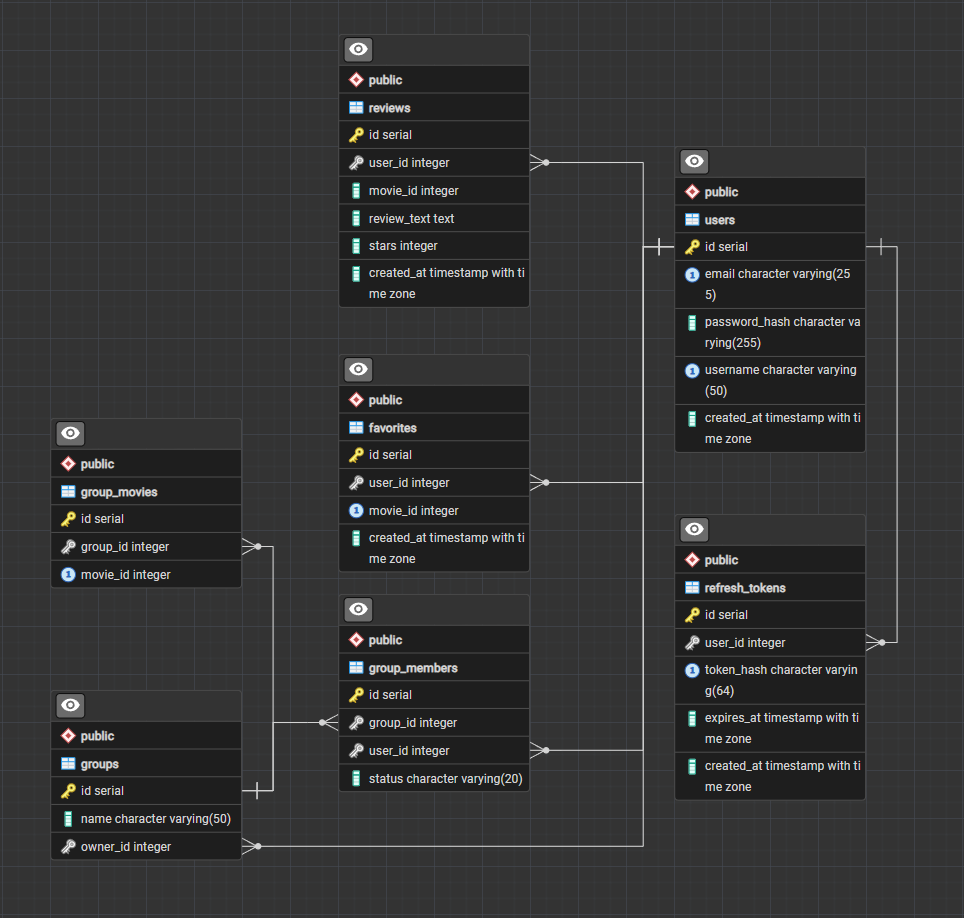

# Database

## 1. Overview

The application uses a PostgreSQL database running in a Docker container. The tables are created automatically from `schema.sql` when the database container starts for the first time.

Movie data is not stored in the database. Tables that refer to movies store only the TMDB movie id (`movie_id`).

## 2. Class diagram

## 3. Tables

| Table | Purpose |
|---|---|
| users | Registered user accounts |
| refresh_tokens | Hashed refresh tokens for staying logged in |
| groups | User-created groups |
| group_members | Group memberships and join requests |
| group_movies | Movies added to groups |
| favorites | Users' favorite movies |
| reviews | Movie reviews |

All foreign keys referencing `users` and `groups` use `ON DELETE CASCADE`. When a user is deleted, their refresh tokens, groups, memberships, favorites and reviews are deleted too. When a group is deleted, its memberships and movies are deleted too.

## 4. Rules and constraints

| Table | Rules |
|---|---|
| users | `email` and `username` are unique. `password_hash` stores a bcrypt hash, never the plain password. `created_at` is set automatically |
| refresh_tokens | Stores a SHA-256 hash of the token, never the token itself. `token_hash` is unique. `expires_at` is 7 days after creation |
| groups | `owner_id` is the user who created the group. Only the owner can delete the group |
| group_members | `status` is `pending` for a join request and `accepted` for a member. Unique (group_id, user_id) prevents duplicate join requests. Only accepted members can view the group page and add movies |
| group_movies | `movie_id` is a TMDB movie id. Unique (group_id, movie_id): the same movie cannot be added twice to the same group |
| favorites | `movie_id` is a TMDB movie id. Unique (user_id, movie_id): the same movie cannot be added twice to the same list |
| reviews | `movie_id` is a TMDB movie id. `stars` must be between 1 and 5 (CHECK). `created_at` is set automatically |
